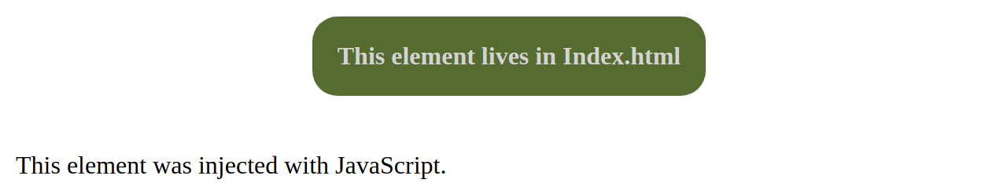

### Description.
Lightweight Webpack/Express server. Supports .js, .css and .scss files.

Just `git clone` and  `npm install` and you are ready to go. 

To start the server run `npm start`.

### Screenshots

